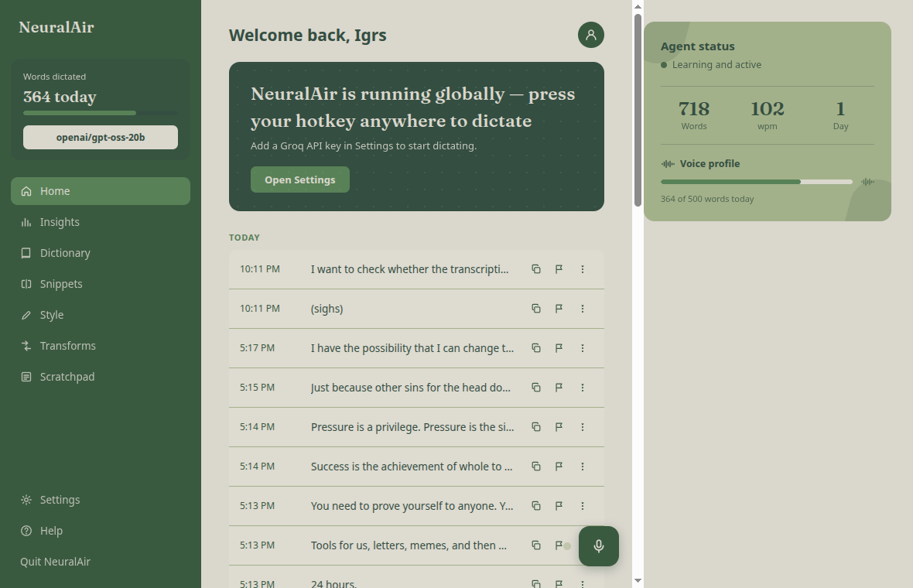
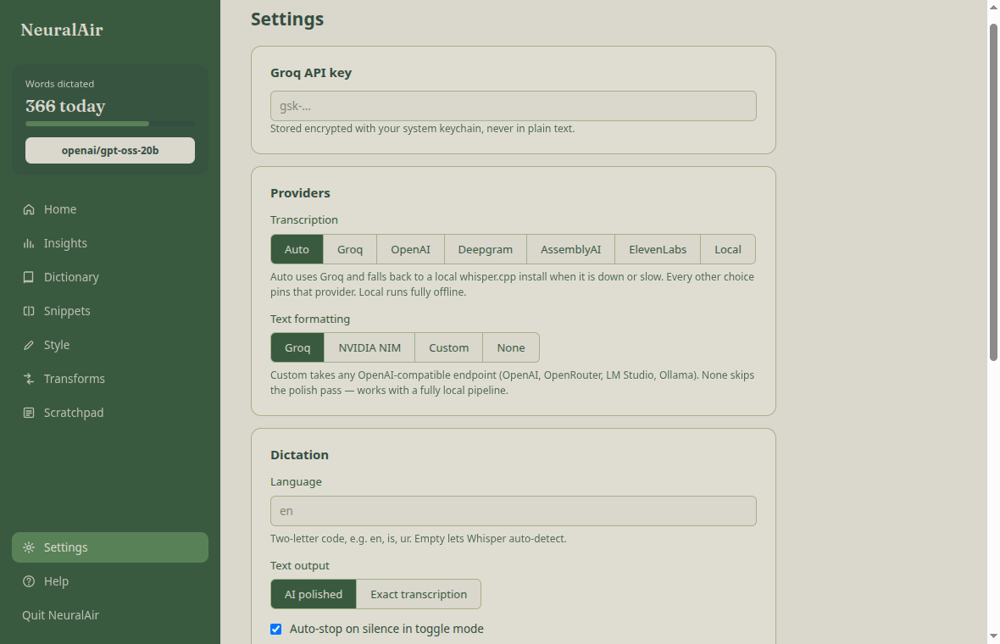
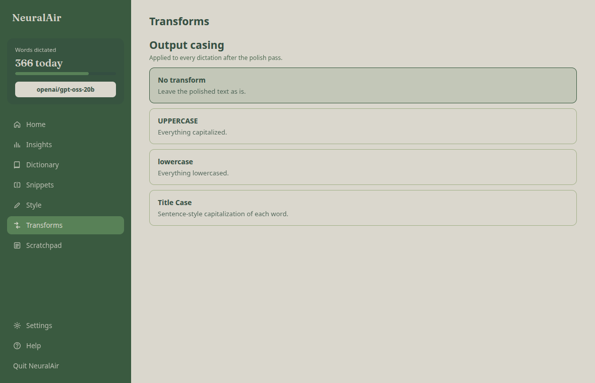

<p align="center">
  
</p>


<p align="center">
  <strong>Frictionless voice dictation for your desktop.<br/>Hold a key, speak, release — polished text lands at your cursor.</strong>
</p>

<p align="center">
  <a href="#license"></a>
  <a href="#setup"></a>
  <a href="#setup"></a>
  <a href="#providers"></a>
  <a href="#providers"></a>
  
</p>

<p align="center">
  
</p>

Free, open-source, privacy-first alternative to Wispr Flow. Voice dictation and AI transcription desktop app that lives in your system tray and gets out of the way.

- **Zero weekly limits** — Bring-Your-Own-Key model (Groq API, or any OpenAI-compatible endpoint). You pay only for what you use, directly to the provider.
- **Privacy-first** — No screen recording, no telemetry, audio never touches disk.
- **Offline-ready** — Local `whisper.cpp` transcription with automatic failover, and an optional no-cloud mode for the full pipeline.
- **Cross-platform** — Linux (X11 *and* Wayland), macOS, Windows.

## Screenshots

| Home | Settings |
|---|---|
|  |  |

| Transform settings | HUD pill (in-flight dictation) |
|---|---|
|  |  |

## Core Loop

Hold a global hotkey → speak → release → audio is transcribed with Whisper → text is polished by an LLM using the active window as context → text is typed into the active window.

```
 ┌─ hotkey ─┐    ┌──────────┐    ┌───────────┐    ┌───────────┐    ┌──────────┐
 │  record  │ →  │ Whisper  │ →  │ active-win │ →  │ LLM polish │ →  │  paste   │
 │ in memory│    │   STT    │    │  context   │    │  per app   │    │ @ cursor │
 └──────────┘    └──────────┘    └───────────┘    └───────────┘    └──────────┘
```

## Features

- **Background-only app** — lives in the system tray, no windows.
- **In-memory audio capture** — dictations never write temp files to disk.
- **Fast transcription** via Groq `whisper-large-v3-turbo`, with the dictation language pinned to stop Whisper guessing wrong languages.
- **LLM text polish** (punctuation, filler-word removal) — any failure falls back to the raw transcript.
- **Text injection** via clipboard + single paste, with your clipboard saved and restored afterwards.
- **Toggle mode** with **VAD auto-stop**: tap the key, speak, stop talking — silence ends the recording (~1.5s).
- **Hold-to-talk**: hold a key while speaking, release to stop.
- **"Scratch that"**: undo the last dictation (backspaces it out, restores your clipboard).
- **Voice commands**: say "new paragraph", "scratch that" or "send" — parsed out before the AI pass, never typed as literal text.
- **Raw dictation mode** — skip the LLM for flags, paths and code where cleanup breaks syntax.
- **Selection transforms** — select text, speak an instruction ("make this more concise", "translate to Urdu"), get it rewritten in place.
- **Local transcription**: `whisper.cpp` offline fallback with auto-failover when Groq is down or slow.
- **Multi-provider BYOK**: transcription (Groq / local) and formatting (Groq / any OpenAI-compatible endpoint / none) are independently configurable.
- **Dictation history** (last 100), persisted across restarts.
- **Custom vocabulary** — feed names and jargon to the polish prompt.
- **Usage insights** — words per day, wpm, day streak, estimated cost.
- **HUD pill** — live mic level and pipeline stage while a dictation is in flight.
- **Recording status in the tray.**
- **Works on X11 and Wayland.**

## Settings window

Open **Settings** from the tray icon. The window has three parts:

- **Sidebar** — words-today counter, the model picker (lists every chat model available on your Groq account; the chosen one runs the polish pass), and navigation.
- **Main feed** — your dictation history grouped by day, with copy buttons, and a floating mic button to start/stop a dictation without touching a hotkey.
- **Status card** — agent status, words/wpm/day-streak stats, voice-profile progress.

Other views, all wired to real settings: **Insights** (words per day), **Dictionary** (custom vocabulary fed to the polish prompt), **Snippets** (click-to-copy text blocks), **Style** (AI polished vs exact transcription), **Transforms** (output casing), **Scratchpad** (autosaved free text).

The Groq API key can be stored in the settings window — encrypted at rest with your OS keychain (`safeStorage`), overriding `.env`.

### Providers

In **Settings → Providers**:

- **Transcription** — `Auto` (Groq first, local whisper.cpp when it is down or slow), or pin one: `Groq`, `OpenAI` (gpt-4o-transcribe family), `Deepgram` (Nova-3), `AssemblyAI` (Universal-2/3.5), `ElevenLabs` (Scribe), or `Local` (fully offline). Each cloud provider takes its own key, stored encrypted.
- **Text formatting** — `Groq`, `NVIDIA NIM` (key + model from build.nvidia.com), `Custom` (any OpenAI-compatible endpoint — OpenAI, OpenRouter, LM Studio, Ollama — with base URL, model and optional key), or `None` for raw transcripts. `Local` + `None` gives a completely offline pipeline.

To enable local transcription, run the setup script once (builds whisper.cpp and downloads a model into `~/.local/share/neuralair/`):

```bash
bash scripts/setup-whisper.sh          # base.en (~148 MB) — good default
bash scripts/setup-whisper.sh small.en # better accuracy, slower
```

### Voice commands

Parsed out of the transcript before any formatting, so they are never typed as text:

| Say | Effect |
|---|---|
| "new paragraph" | paragraph break at that spot |
| "scratch that" | alone: undoes the previous dictation; mid-dictation: discards what you said before it |
| "send" | presses Enter after the text lands (only when spoken last) |

Saying a snippet's name (optionally "insert …") inserts that snippet verbatim.

### Raw dictation

For flags, paths, and code where cleanup breaks syntax — record one dictation with no LLM pass:

- **Shift + your hold-to-talk key** (the evdev listener tracks the modifier), or
- bind `neuralair --toggle-raw` to a desktop shortcut.

### Selection transforms

Select text anywhere, then run `neuralair --ask` (bind it to a shortcut) and speak an instruction — "make this more concise", "fix the grammar", "translate to Urdu". The selection is captured via the clipboard, rewritten by your configured LLM, and pasted over the original. With nothing selected it degrades to a normal dictation.

### HUD pill

While a dictation is in flight, a small pill floats top-center: pulsing dot and live mic-level bar while listening, then the pipeline stage with live elapsed time — Listening → Transcribing → Polishing → Done.

## Setup

1. Get a Groq API key from [console.groq.com/keys](https://console.groq.com/keys).
2. Create a `.env` file in the project root:
   ```
   GROQ_API_KEY=your_key_here
   DICTATION_LANGUAGE=en
   ```
   `DICTATION_LANGUAGE` is an optional ISO-639-1 code (e.g. `en`, `is`, `ur`). Unset = auto-detect, which can hallucinate the wrong language on short, context-free speech.
3. Install and run:
   ```bash
   npm install
   npm run dev
   ```

## Usage

### Toggle mode

`Ctrl+Space` (X11/macOS/Windows), or bind the command below to a key in your desktop's shortcut settings (recommended on Wayland/GNOME/COSMIC):
```
./node_modules/.bin/electron . --toggle
```
Tap once to start, again to stop — or just stop talking: VAD auto-stop ends the recording after ~1.5s of silence.

### Hold-to-talk (optional)

Set `HOLD_KEYCODE` in `.env` to a Linux input code (e.g. `67` = F9, `87` = F11):
```
HOLD_KEYCODE=67
```
Hold that key while speaking; release to stop. The app reads the key directly from the keyboard, so do **not** also bind it in your desktop's shortcut settings. Pick a key that types nothing on its own (a function key, not a letter).

### Scratch that

Undo the last dictation — bind this command to a key (e.g. `Ctrl+Shift+Backspace`), or use the tray menu:
```
./node_modules/.bin/electron . --scratch
```
It backspaces out the last injected text and restores the clipboard that was there before the dictation. Works best right after a dictation, with the cursor still where the text landed.

### Tunables (optional, in `.env`)

| Variable | Default | Effect |
|---|---|---|
| `VAD_THRESHOLD` | `0.01` | Silence loudness threshold (lower = more sensitive) |
| `VAD_SILENCE_MS` | `1500` | Silence duration before auto-stop |
| `NEURALAIR_NO_VAD` | unset | Set to `1` to disable auto-stop |

## Build

```bash
npm run dist:linux   # AppImage + .deb
npm run dist:win     # NSIS installer — requires wine on Linux
npm run dist:mac     # .dmg — must run on macOS
```

Packages land in `release/`.

## License

MIT
